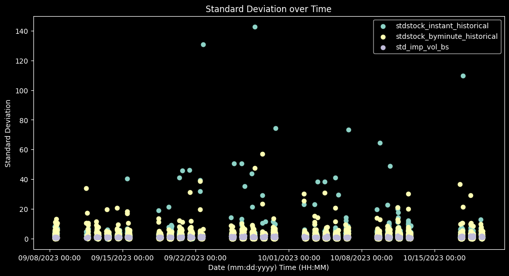
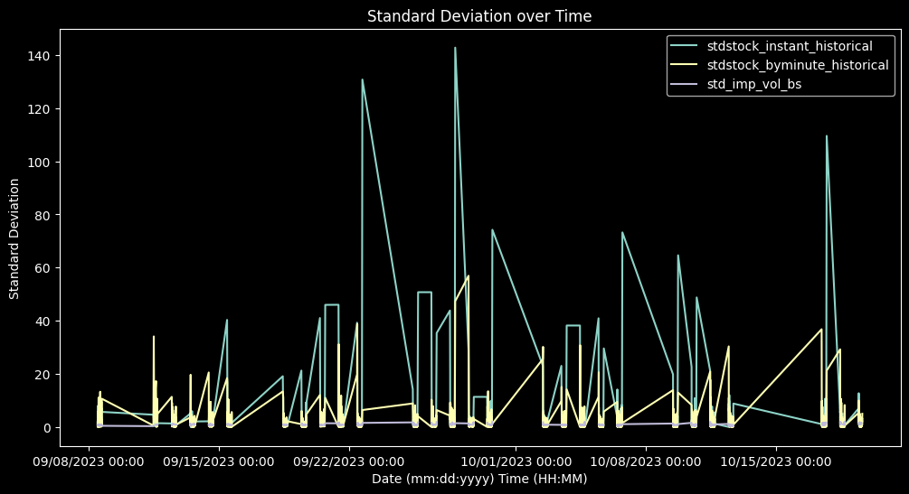
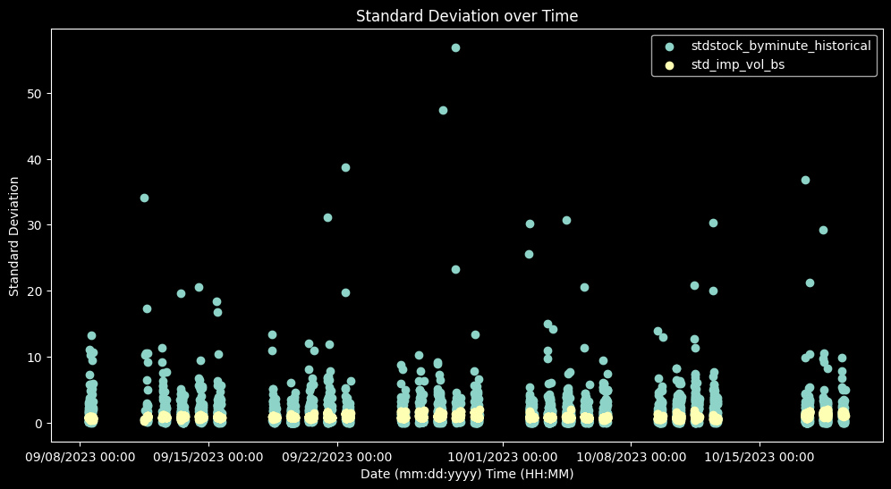
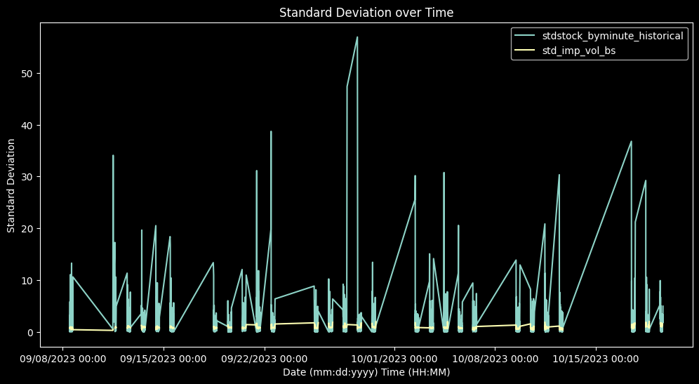

# **Computing Implied Volatilities for Argentine Options Dataset Using C++ and Python**

## Project Overview

This project focuses on calculating implied volatilities for an options dataset from Argentina, a task that involves iterative calculations to estimate these values accurately. Originally developed in Python, the project leverages data science libraries like **pandas** for data manipulation and **matplotlib** for visualization. To explore the efficiency and performance of lower-level programming for scientific computing, the project was subsequently implemented in **C++** using **xtensor** for numerical operations and **rapidcsv** for data handling.

The C++ implementation is provided as a Jupyter notebook (using the xeus-cling kernel) and as a standalone C++ file. The code outputs results in CSV format, enabling easy analysis and comparison. By comparing implementations in both languages, this project offers insights into the computational demands and viability of performing data science tasks in C++, which currently lacks comprehensive, integrated data science libraries.

## Features

- **Python Implementation**: Leveraged pandas for data manipulation, iterative calculations, and matplotlib for data visualization. Notebook is present at "python_implementation" folder.
- **C++ Implementation**: Implemented using xtensor for efficient numerical calculations and rapidcsv for CSV handling. The results are saved in CSV format for compatibility with further data analysis tools.
  Both notebook and cpp files and dependencias lie into "cpp_implementation" folder.
- **Comparative Study**: Investigates the trade-offs of different methods for calculating implied volatility in a practical manner.

This project provides a functional pipeline to calculate implied volatilities and aims to bridge the gap for data science applications in C++.

## Black-Scholes Formula and Implied Volatility Calculation

The Black-Scholes formula is a mathematical model used to calculate the theoretical price of European call and put options. The formula for the price \( C \) of a European call option is given by:

$$
C = S \cdot N(d_1) - K \cdot e^{-r \cdot T} \cdot N(d_2)
$$

where:

- \( S \) is the current stock price,
- \( K \) is the strike price of the option,
- \( T \) is the time to maturity or expiration (in years),
- \( r \) is the risk-free interest rate (annualized) ,
- \( N \) represents the cumulative distribution function of a standard normal distribution,
- \( $ d_1 $ \) and \( $ d_2 $ \) are calculated as:

$$
d_1 = \frac{\ln\left(\frac{S}{K}\right) + \left(r + \frac{\sigma^2}{2}\right) T}{\sigma \sqrt{T}}
$$

$$
d_2 = d_1 - \sigma \sqrt{T}
$$

### Implied Volatility (σ) Calculation

Implied volatility is the value of \( $\sigma$ \) that, when plugged into the Black-Scholes formula, yields a theoretical option price equal to the observed market price. Since there is no closed-form solution for \( $\sigma$ \), it must be determined iteratively.

In this project, we use the **bisection method** to solve for implied volatility. The bisection method iteratively refines estimates of \( $\sigma$ \) by narrowing down an interval in which the solution lies. It compares the theoretical option price with the observed price, adjusting the bounds until the price difference is within an acceptable tolerance level.

---

This project demonstrates both the theoretical and practical aspects of calculating implied volatility using the Black-Scholes model in Python and C++.

### Sample of processed dataframe (from Exp_octubre.csv)

<table border="1" class="dataframe">
  <thead>
    <tr style="text-align: right;">
      <th></th>
      <th>description</th>
      <th>strike</th>
      <th>kind</th>
      <th>bid</th>
      <th>ask</th>
      <th>underBid</th>
      <th>underAsk</th>
      <th>created_at</th>
      <th>avopt</th>
      <th>avstock</th>
      <th>time_to_maturity</th>
      <th>stdstock_instant_historical</th>
      <th>underBid_prev</th>
      <th>underAsk_prev</th>
      <th>avg_current</th>
      <th>avg_previous</th>
      <th>stdstock_byminute_historical</th>
    </tr>
  </thead>
  <tbody>
    <tr>
      <th>0</th>
      <td>GFGC1033OC</td>
      <td>1033</td>
      <td>CALL</td>
      <td>250.000</td>
      <td>NaN</td>
      <td>1211.15</td>
      <td>1213.0</td>
      <td>2023-09-08 11:28:00</td>
      <td>250.0000</td>
      <td>1212.075</td>
      <td>0.117423</td>
      <td>1.308148</td>
      <td>NaN</td>
      <td>NaN</td>
      <td>1212.075</td>
      <td>NaN</td>
      <td>NaN</td>
    </tr>
    <tr>
      <th>1</th>
      <td>GFGC1033OC</td>
      <td>1033</td>
      <td>CALL</td>
      <td>270.602</td>
      <td>NaN</td>
      <td>1211.00</td>
      <td>1212.0</td>
      <td>2023-09-08 11:29:00</td>
      <td>270.6020</td>
      <td>1211.500</td>
      <td>0.117421</td>
      <td>0.707107</td>
      <td>1211.15</td>
      <td>1213.0</td>
      <td>1211.500</td>
      <td>1212.075</td>
      <td>0.406586</td>
    </tr>
    <tr>
      <th>2</th>
      <td>GFGC1033OC</td>
      <td>1033</td>
      <td>CALL</td>
      <td>270.652</td>
      <td>324.654</td>
      <td>1208.00</td>
      <td>1211.0</td>
      <td>2023-09-08 11:30:00</td>
      <td>297.6530</td>
      <td>1209.500</td>
      <td>0.117419</td>
      <td>2.121320</td>
      <td>1211.00</td>
      <td>1212.0</td>
      <td>1209.500</td>
      <td>1211.500</td>
      <td>1.414214</td>
    </tr>
    <tr>
      <th>3</th>
      <td>GFGC1033OC</td>
      <td>1033</td>
      <td>CALL</td>
      <td>281.571</td>
      <td>322.127</td>
      <td>1210.00</td>
      <td>1211.0</td>
      <td>2023-09-08 11:32:00</td>
      <td>301.8490</td>
      <td>1210.500</td>
      <td>0.117415</td>
      <td>0.707107</td>
      <td>1208.00</td>
      <td>1211.0</td>
      <td>1210.500</td>
      <td>1209.500</td>
      <td>0.707107</td>
    </tr>
    <tr>
      <th>4</th>
      <td>GFGC1033OC</td>
      <td>1033</td>
      <td>CALL</td>
      <td>281.611</td>
      <td>322.107</td>
      <td>1211.00</td>
      <td>1212.5</td>
      <td>2023-09-08 11:33:00</td>
      <td>301.8590</td>
      <td>1211.750</td>
      <td>0.117413</td>
      <td>1.060660</td>
      <td>1210.00</td>
      <td>1211.0</td>
      <td>1211.750</td>
      <td>1210.500</td>
      <td>0.883883</td>
    </tr>
    <tr>
      <th>...</th>
      <td>...</td>
      <td>...</td>
      <td>...</td>
      <td>...</td>
      <td>...</td>
      <td>...</td>
      <td>...</td>
      <td>...</td>
      <td>...</td>
      <td>...</td>
      <td>...</td>
      <td>...</td>
      <td>...</td>
      <td>...</td>
      <td>...</td>
      <td>...</td>
      <td>...</td>
    </tr>
    <tr>
      <th>3291</th>
      <td>GFGC1033OC</td>
      <td>1033</td>
      <td>CALL</td>
      <td>100.001</td>
      <td>115.000</td>
      <td>1139.05</td>
      <td>1139.9</td>
      <td>2023-10-19 14:43:00</td>
      <td>107.5005</td>
      <td>1139.475</td>
      <td>0.003158</td>
      <td>0.601041</td>
      <td>1138.95</td>
      <td>1139.5</td>
      <td>1139.475</td>
      <td>1139.225</td>
      <td>0.176777</td>
    </tr>
    <tr>
      <th>3292</th>
      <td>GFGC1033OC</td>
      <td>1033</td>
      <td>CALL</td>
      <td>100.001</td>
      <td>115.000</td>
      <td>1135.55</td>
      <td>1137.0</td>
      <td>2023-10-19 15:11:00</td>
      <td>107.5005</td>
      <td>1136.275</td>
      <td>0.003104</td>
      <td>1.025305</td>
      <td>1139.05</td>
      <td>1139.9</td>
      <td>1136.275</td>
      <td>1139.475</td>
      <td>2.262742</td>
    </tr>
    <tr>
      <th>3293</th>
      <td>GFGC1033OC</td>
      <td>1033</td>
      <td>CALL</td>
      <td>100.001</td>
      <td>108.000</td>
      <td>1140.10</td>
      <td>1142.0</td>
      <td>2023-10-19 15:21:00</td>
      <td>104.0005</td>
      <td>1141.050</td>
      <td>0.003084</td>
      <td>1.343503</td>
      <td>1135.55</td>
      <td>1137.0</td>
      <td>1141.050</td>
      <td>1136.275</td>
      <td>3.376435</td>
    </tr>
    <tr>
      <th>3294</th>
      <td>GFGC1033OC</td>
      <td>1033</td>
      <td>CALL</td>
      <td>100.008</td>
      <td>108.000</td>
      <td>1143.00</td>
      <td>1144.0</td>
      <td>2023-10-19 15:25:00</td>
      <td>104.0040</td>
      <td>1143.500</td>
      <td>0.003077</td>
      <td>0.707107</td>
      <td>1140.10</td>
      <td>1142.0</td>
      <td>1143.500</td>
      <td>1141.050</td>
      <td>1.732412</td>
    </tr>
    <tr>
      <th>3295</th>
      <td>GFGC1033OC</td>
      <td>1033</td>
      <td>CALL</td>
      <td>100.008</td>
      <td>115.000</td>
      <td>1135.00</td>
      <td>1138.0</td>
      <td>2023-10-19 15:38:00</td>
      <td>107.5040</td>
      <td>1136.500</td>
      <td>0.003052</td>
      <td>2.121320</td>
      <td>1143.00</td>
      <td>1144.0</td>
      <td>1136.500</td>
      <td>1143.500</td>
      <td>4.949747</td>
    </tr>
  </tbody>
</table>

3296 rows × 17 columns

underBid and underAsk are the stock minimal and maximun prices.
bid and ask are the option minimal and maximum prices.

### Analysis for mean volatilities obtained

It\'s convenient to analyze the mean of every volatility obtained by
minute by taking it\'s mean and standard deviations to see if they
compare. Two ways of estimating historical volatility were used:

- \"instant historical volatility\": It is measured as the sample
  standard deviation of \"underBid\" and \"underAsk\" values of the
  same minute, we could think is it as similar approach to a \"range\"
  of values.
- \"by minute historical volatility\": It is measured as the standard
  deviation of the values between the actual minute and the previous
  minute. The values taken into account for each minute are the mean
  of underBid and underAsk prices. A few points are not \"minute\"
  deviations because dataframe has some jumps in time (when there are
  weekends or holidays) but won\'t interfere as much in the analysis
  as they are few and it\'s values won\'t escape the deviation of the
  popoulation.

<table border="1" class="dataframe">
  <thead>
    <tr style="text-align: right;">
      <th></th>
      <th>stdstock_instant_historical</th>
      <th>stdstock_byminute_historical</th>
      <th>std_imp_vol_bs</th>
    </tr>
  </thead>
  <tbody>
    <tr>
      <th>mean</th>
      <td>2.214854</td>
      <td>1.581371</td>
      <td>0.864364</td>
    </tr>
    <tr>
      <th>std %</th>
      <td>547.337890</td>
      <td>287.457557</td>
      <td>20.385041</td>
    </tr>
  </tbody>
</table>

### Analysis with Annualized historical volatilies

I think it\'s not coherent to annualize the volatility obtained from
minute, if we are at least estimating that volatility won\'t change that
much in a period. The typical method to annualize volatility by
multypling by a factor is the assumption that volatility would increase
linearly over time by a factor (and a big one) which makes no sense with
current assumptions and make results hard to compare (annualized data
would be much bigger). But we do it anyways to show it\'s effect. We
supose we have trading years of 252 days, with 6h of trading per days,
and 60 minutes per hour which are typical estimatations in
annualization. The factor to correct the volatilities will include a
square root of the time for taking into account that we are dealing with
standard deviations instead of variance (variance is the measure of
dispersion that behave lineraly).

### Scatter, only byminute historical

### Lineplot, only by minute

### Coherent analysis of data

A more relevant analysis would be to estimate volatility from a bigger
period instead of minute data. The standard deviation of only two points
per minute is not that representative of reality, it would be an OK
estimate if analizing times in a minute, but would crearly fail when
extrapolating that result to another time period like years. Although
Black-Scholes would do the same in this case, black-scholes is usually
used with some success with at least day data, which would extrapolate
to a year much better than minute. Black-scholes formula would estimate
the volatility as a constant which we know from reality that volatility
varies heavily in time, but also considers stochastic movement of stock
prices, being the today\'s price (and it\'s similar values to say for
example in one standard deviation) the most probable future values, so
under this hypothesis the model is congruent with itself and expects
less variation of volatility values from different data points.

Also the model won\'t preddict the call price for all the real-life
dataset values:

- Black-scholes formula (as a function of sigma) is an asinthotic
  sigmoid function, it will present clear asymptotes when plotting
  representing that ends up representing global maxima and minima.
- Black-scholes formula (as a function of sigma) is a monothonic
  increasing function, which excludes the posibility of local maxima
  and minima. This traits makes the value of the Call prices
  (function) easy to solve by any simple numerical method, but will
  never solve if function with real life parameters has minima that
  never reach the observed call price. In other words the best
  prediction of the model might not match with reality by the minima
  and maxima defined by it\'s asymptotes. So in our case 284 points
  (of the 3296) are left out of the analysis because no sigma can
  solve the equation for those values (we could get an alternative
  analysis by taking the value of the minima asymptote instead of
  leaving the point, not done in this study).

A proposed better analysis would simply take into account having an
annualized historical volatitity estimated the whole dataset, which
would translate int a 1.5 months period (that extrapolate better to a
year than a minute) and analizing these averages, not locking to minute
data. We do that next

As analysis, we could say that black-scholes prediction is less
disperse, logically the model itself assumes that volatility is constant
over time, so values obtained vary as far as 20% from mean in most cases
(as 1 std). In contrast, historical volatilies are way more disperse
having and dispersion of 290% and 550% (as relative std) which could
makes us doubt even if this results could have normal distribution.
Because of this enormous difference in dispersion results are not really
comparable, most parametric statistic tests would require normality and
homoscedasticity (same variance) which are clearly different. We could
only conclude that as an analysis of pure exactness historical
volatilies are at least 2 times bigger, but again the huge dispersions
simply implies that black-scholes is not representative of reality. Also
black-schoels is a model for european options (they could only excercise
on expiration date, in contrast to american options that can excersice
any time before), and we are dealing with american-type options, but on
most cases it estimates well with simpler mathematics, since the aren\'t
usually reasons to excercise much before expiry date, so we could expect
differences but not they would probably not be that big (it would solve
integrals in the black scholes equation by numerical methods instead of
having a pre-made formula). Anyways black-scholes is at least a starting
point of prediction and possibly would be a good theoritical framework
for a hybrid model where differences with theory might be fitted with
statiscal methods giving a more extrpolable model.

### Is C++ a right tool for This Problem?

While it's expected that working in C or C++ will take longer than in an interpreted language, the challenges go beyond syntax and manual memory management. C++ gives many problems and it's not the optimal langauge for this task. The main issue lies in the lack of built-in tools optimized for handling complex datasets, making these languages less suitable for data-intensive tasks. Here’s why:

- **Date Interpretation**: Dates are notoriously difficult to work with, and there’s no native support for parsing or handling dates in a streamlined way. Handling dates in C++ typically requires manual string parsing and transformation.
  
- **Complex Calculations**: While some calculations may appear straightforward, they can quickly become complex to implement manually without the help of specialized libraries.

- **Compilation Challenges**: Using libraries in C++ can be daunting due to the time required to compile and configure dependencies. Header-only libraries, while practical, can significantly increase compilation time.

- **CSV Readers**: There’s a lack of CSV readers that can automatically interpret most data types. Available readers might not handle missing or atypical data well, and high-quality readers, like `rapidcsv`, may not integrate seamlessly with other libraries for calculations.

- **No Labeling Support**: C++ lacks integrated support for "labeled data," making data access cumbersome and forcing you to treat columns as ordered by numerical indices rather than named fields.

- **Integration with Calculation Libraries**: Many C++ numerical libraries (such as Eigen, Armadillo, and xtensor) have poor or no integration with CSV readers, creating additional complexity for handling datasets. These libraries also don't handle strings or boolean columns well, making it necessary to separate numeric and non-numeric data.

- **Limited NaN Handling**: C++ has multiple NaN types (quiet, signaling, etc.) and can treat out-of-range values inconsistently across libraries. Each library interprets NaN differently, and handling other data types as NaN may require significant manual effort.

- **NaN in Calculations**: Due to inconsistent NaN interpretations, calculating means or handling NaN data can be challenging. Decisions to include or exclude NaNs often need to be made manually using conditional checks.

- **Lack of Rapid Prototyping Tools**: While C++ notebooks exist, they are inconvenient for iterative work, often requiring kernel resets due to memory overwrite issues.

- **Visualization Challenges**: Visualization libraries in C++ that are designed for notebook environments are in early development and rely on JavaScript, while other posibilities like math++ are not header only nor notebook compatible and have many dependencies and compilation problems.

### Alternative Solutions

- **Python**: Python is clearly the optimal tool for this kind of project, covering all the points mentioned above.
  
- **Excel spreasheets**: Even without writing any code, this problem could be adequately solved with spreadsheets. It provides built-in graphing, error handling, and some basic iterative tools. However looking for atypical data, handling nan could have not wanted behaviour, and iteartive tools are basic and are quite "blackboxy" not knowing exaclty what's happening. 

- **Go**: If long-term performance and integration are priorities, Go could be a viable alternative. It has robust libraries for data science, supports cross-platform compilation, and offers seamless notebook integration (at least for linux).

### Conclusions

Implied volatilies have been succesfully calculated by two ways.
A problem for this calculations is that is sensitive to some data that might not have solution for this equation and must be handled adequately.
Python results in the most adequate language for the job. While c++ can be done, problems with compilation and not avaialable useful libraries makes it a poor choice, however it might be suited for very large datasets. Although in that case i would recommend to give "Go" language a try, but that requires further investigation.

